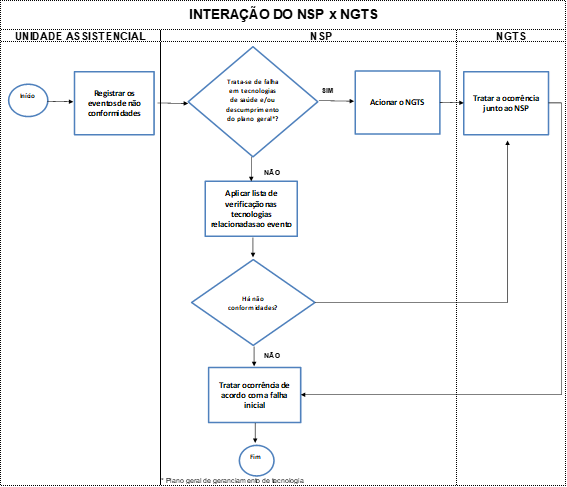
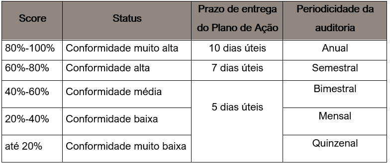

{width=10%}

Considerando a diversidade de temas da área da saúde e sua dinâmica própria da área de informação, o conteúdo desta publicação recebe atualizações freqüentes. 

Em cada edição, todas as instruções normativas apresentados são revisados, com atualização de dados e de fontes de informação, entre outros itens pertinentes. 

Ademais, novos requisitos podem ser incluídos para fortalecer o gerenciamento das tecnologias em saúde, controle dos processos e informações.

Novas versões serão publicadas para atualizá-lo sempre que for identificada alguma melhoria, seguindo as diretrizes da [Agência Nacional de Vigilância Sanitária](https://www.gov.br/pt-br/orgaos/agencia-nacional-de-vigilancia-sanitaria) e outras regulações e ou legislações que venham a vigorar.

***
# Objetivo
***
Esta diretriz tem como objetivo estabelecer os requisitos mínimos para o processo de gerenciamento de tecnologias em saúde, as responsabilidades do Núcleo de Gerenciamento de Tecnologias, da unidades Assistenciais Prevent Senior e dos programas estabelecidos para cumprimento da [RDC nº 509 de 27 de maio de 2021](https://www.in.gov.br/en/web/dou/-/resolucao-rdc-n-509-de-27-de-maio-de-2021-323002855).

***
# Escopo das tecnologias em saúde
***
Estão contemplados nesse plano as seguintes tecnologias em saúde:

I - produtos para saúde, incluindo equipamentos de saúde e excluindo equipamentos definidos como “gerais”

II - produtos de higiene e cosméticos;

III - medicamentos; e

IV - saneantes.

Não está contemplado nesse plano o gerenciamento e monitoramento dos protocolos médicos aplicados na área assistencial, sejam preventivos, curativos (clínicos e cirúrgicos), de cuidados em geral ou de diagnósticos

***
# Áreas de aplicação
***
Âmbito hospitalar, ambulatorial e serviços de apoio (diagnóstico e terapia) da Prevent Senior São Paulo.

***
# Responsabilidades
***
**Do Núcleo Corporativo de Gerenciamento de Tecnologia em Saúde**

1.	Elaborar a diretriz geral para gerenciamento das tecnologias em saúde com as especificações mínimas que devem ser seguidas pelos serviços técnicos e unidades assistenciais;

2.	Assessorar os serviços na elaboração do seu programa de gerenciamento de tecnologias em saúde (PGTS);

3.	Assessorar as áreas no desenvolvimento e padronização dos seus processos;

4.	Realizar auditorias para monitorar o cumprimento do plano e disponibilizar os relatórios;

5.	Apoiar a unidade assistencial junto ao Núcleo de Segurança do Paciente na elaboração dos planos de ação de tratativas de não conformidade, melhorias e/ou mitigação de riscos, ad hoc.

**Das unidades assistenciais Prevent Senior**

1.	Aplicar as orientações dessa diretriz;

2.	Estabelecer um núcleo local técnico-executivo;

3.	Elaborar o seu programa local de gerenciamento considerando as condições específicas da tecnologia, compatíveis com o tipo e aplicação; 

4.	Capacitar os envolvidos;

5.	Notificar,  tratar as não conformidades e cumprir as regras de Tecnovigilância;

6.	Promover as ações de melhoria;

7.	Guardar os registros de cumprimento do plano.

**Núcleo de Segurança do Paciente**

1.	O NSP irá retroalimentar o NGTS quando reconhecer a tecnologia da saúde como causa da falha da falha, causa de risco e/ou oportunidade de melhoria;

2.	Assessorar a unidade para as notificações de Tecnovigilância associadas às tecnologias da saúde quando relacionadas à near miss, adverso e sentinela.

***
# Requisitos mínimos para a incorporação de novas tecnologias
***
{ width=100%}

***
## Validação
***
Essa atividade tem como objetivo avaliar se a tecnologia cumpre com as especificações e desempenho necessários ao processo.

A decisão de incorporar uma nova tecnologia deverá considerar a comparação entre a tecnologia objeto de análise e aquelas já incorporadas como os demais atributos e,

De análise fortemente recomendável:

I - segurança; 
II - acurácia; 
III - eficácia; 
IV - efetividade; 

De análise desejável:

V - custos; VI - custo-efetividade; VII - impacto orçamentário;

        Registro: Protocolo de validação
     O protocolo de validação é um roteiro simplificado para condução do processo de análise de uma nova tecnologia. 
    As informações precisam ser apresentadas com uma escrita clara e de fácil entendimento.
    É recomendável que os serviços mantenham um controle interno das tecnologias avaliadas.
    O protocolo com as informações da validação deve estar disponível em tempo oportuno para apoiar as decisões de aquisição e implantação.

***
## Aquisição
***
As atividades de requisição devem seguir conforme as diretrizes da Prevent Senior vigente no momento. 

     Registros: Contratos, registros no sistema operacional de Compras

***
# Inclusão emergencial de novas tecnologias da saúde
***
Quando caracterizada uma urgência em que não há tempo suficiente para a realização da validação de uma nova tecnologia e que a ausência dessa tecnologia possa ocasionar prejuízo, comprometer a segurança do paciente ou da continuidade do processo assistencial, é necessária uma avaliação provisória com:

- Comprovação de que a tecnologia tem o registro de uso liberado pela ANVISA;

- Atestado emitido por outras empresas da área da saúde que o fornecedor possui capacidade técnica de atendimento (venda e suporte técnico-operacional);

- Consulta de registros de Tecnovigilância: o sistema possui alertas, recalls e informações relevantes sobre segurança e riscos de equipamentos da saúde, que devem ser considerados na avaliação.

O gestor da área deve manter os registros dessa avaliação prévia junto ao protocolo de validação final que deve ser realizado em até 90 dias do início de uso da tecnologia.

Até a conclusão da validação, recomenda-se mobilizar uma equipe competente para monitorar o desempenho do item.

***
# Implantação
***
Essa atividade tem como objetivo colocar a tecnologia validada previamente em uso.

Para que a tecnologia seja coloca em uso, ações devem ser planejadas para minimizar os riscos e impactos nos processos assistenciais. 
Sendo assim, recomenda-se o realização das seguintes ações:

1. Avaliar a infraestrutura necessária para instalação ou guarda;
2. Avaliar a necessidade de revisão dos processos e atualização de documentos de referência;
3. Estudar as possíveis falhas possíveis da tecnologia e estabelecer procedimentos de barreira e contingência; 
4. Prover a comunicação e treinamento dos envolvidos;
5. Avaliar os procedimentos internos de rastreabilidade, testes periódicos de funcionamento, manutenções etc. e outros ações aplicáveis à tecnologia;
6. Estabelecer o procedimento de descarte da tecnologia;
7. Estabelecer o plano de contingência para indisponibilidade da tecnologia.

     	Registros: Protocolo de implantação, desenho instrucional, FMEA, atas de reunião, Listas de presença, DOPs
      

***
# Tecnologias implantadas antes da vigência desse plano
***
Dar-se-á como previamente adequadas todas as tecnologias de saúde em uso e os processos relacionados até a presente data, desde que não sejam suspensos por determinação legal ou decisão interna.

Os registros “protocolo de validação” e “protocolo de implantação” serão obrigatórios para as tecnologias que forem implantadas nos serviços assistenciais da Prevent Senior a partir da data de publicação desse plano.

Contudo, para as tecnologias implantadas anteriormente à vigência desse plano, as unidades assistenciais, quando solicitado, devem disponibilizar os meios de evidenciar que as tecnologias estão sob controle e monitoramento, que os documentos relacionados estão atualizados e os envolvidos treinados para uso.

***
# Controle e utilização
***
Utilização da tecnologia de acordo com as premissas do fabricante e dos processos internos.

A unidade deve ter capacidade de demonstrar as tecnologias ativas (em uso), controles aplicados e providenciar meios de rastreabilidade de uso.

     	Registro: DOPs, registros nos sistemas operacionais, registros de não conformidade, indicadores de desempenho

***
# Descarte
***
O descarte deve ocorrer de acordo com as orientações do fabricante da tecnologia (localidade e tempo) e o plano de gerenciamento de resíduos da unidade.

***
# Especificações dos planos de gerenciamento de tecnologias da saúde – por serviço
***
Os planos locais de gerenciamento devem cumprir com os requisitos dessa diretriz, mas não se limitar a ela, complementando com os controles necessários que devem ser empregados de acordo com a tecnologia em uso, compatíveis com o tipo e aplicação da tecnologia, meios de rastreabilidade de uso, procedimentos de boa prática e legislações específicas de cada área. 

Devem estar sob responsabilidade do RT da área ou da unidade com conselho ativo, abranger a matriz de responsabilidades dos serviços/áreas do local e o cronograma de capacitação dos envolvidos nos procedimentos.

Deve também prever um programa períodico de verificação da infraestrutura de acordo com a legislação vigente e cumprimento das normas de segurança no que tange aos equipamentos de proteção individuais e coletivos.

A unidade deve estabelecer os mecanismos para que as informações sobre as atividades de gerenciamento das tecnologias estejam prontamente disponíveis

***
# Auditorias e verificações
***
A testagem de conformidade ao plano se dará por:

•	Auditoria in loco realizado pela equipe do SGQ - periodicidade regulada de acordo com o desempenho da unidade;

•	Auditoria documental via registros nos sistemas informatizados pela equipe do SGQ - periodicidade semestral;

•	Retroalimentação pela equipe de NSP durante as investigações de ocorrências que envolvam tecnologias da saúde, conforme o esquema:

{ width=77%}

De acordo com os achados de conformidade com esse plano, os serviços de saúde serão classificados em cinco grupos: 

{width=50%}

O programa de auditoria para monitoramento da aderência à RDC 509 pode ser complementado, a qualquer tempo, por auditor independente com conhecimentos técnicos na área.

Após cada evento de auditoria e anualmente, o NGTS irá publicar aos interessados o relatório de performance da unidade e apoiará a unidade na elaboração dos planos de ação necessários.

***
# Normas relacionadas
***
[Resolução de Diretoria Colegiada - RDC nº 332, de 1º de dezembro de 2005](https://www.in.gov.br/en/web/dou/-/resolucao-rdc-n-332-de-23-de-dezembro-de-2019-235332281)

[Resolução de Diretoria Colegiada - RDC nº 36, de 25 de julho de 2013](https://www.in.gov.br/en/web/dou/-/resolucao-de-diretoria-colegiada-rdc-n-339-de-20-de-fevereiro-de-2020-244864047)

[Resolução de Diretoria Colegiada - RDC nº 34, de 11 de junho de 2014](https://www.in.gov.br/en/web/dou/-/resolucao-de-diretoria-colegiada-rdc-n-399-de-7-de-julho-de-2020-265632424)

[Resolução de Diretoria Colegiada - RDC Nº 222, de 28 de março de 2018. ](https://www.gov.br/anvisa/pt-br/centraisdeconteudo/publicacoes/servicosdesaude/publicacoes/rdc-222-de-marco-de-2018-comentada.pdf)

[Resolução de Diretoria Colegiada - RDC Nº 15, de 15 de março de 2012](https://www.gov.br/anvisa/pt-br/centraisdeconteudo/publicacoes/servicosdesaude/publicacoes/rdc-222-de-marco-de-2018-comentada.pdf/view)

 

SGQ Prevent Senior, 2022.  Copyleft .

***

|**Elaboração**                               |**Função**              |**Data**     
|---------------------------------------------|------------------------|-------------|
|Ahfia Marchesi Dobrochinski                  |*Especialista em Qualidade *  |31/03/2022   |
|**Revisão**                                  |**Função**              |**Data**     |
|XXXXXXXXXX                                   |*XXXXXX*      |XX/XX/XX   |
|**Aprovação**                                |**Função**              |**Data**     |
|XXXXXXXXXX                                   |*XXXXXX*      |XX/XX/XX   |
:Histórico da Revisão

  

